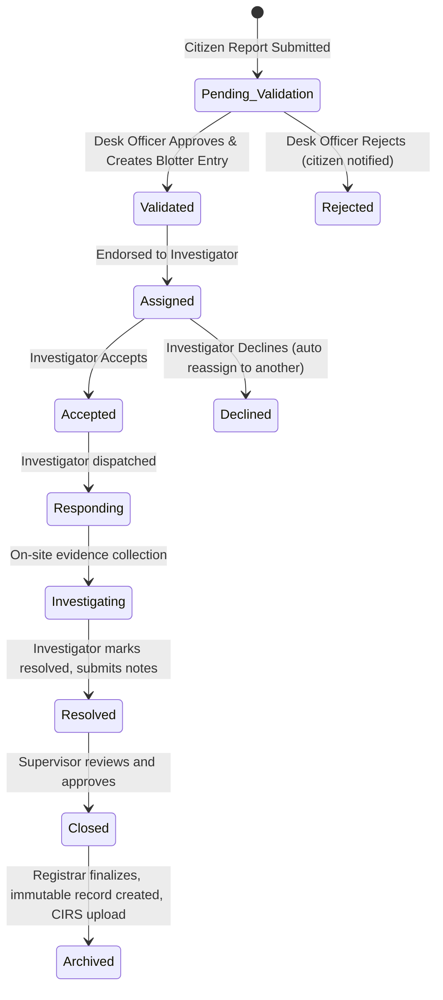

---

# Product Requirement Document: PNP Citizen Crime Reporting System

**Version:** 1.1
**Date:** October 3, 2025
**Author:** Project Manager

---

## 1. Introduction

### 1.1 Overview

The **PNP Citizen Crime Reporting System (CCRS)** is a digital platform designed to streamline **non-emergency crime reporting** between the public and the Philippine National Police (PNP) at the **municipal level**. It digitizes the blotter and IRF processes, enforces standardized workflows, and integrates with the national **Crime Incident Recording System (CIRS)**.

### 1.2 Problem Statement

Traditional crime reporting is manual and paper-based, requiring physical visits to the station and multiple redundant steps. This leads to:

* Inefficient workflows and slow reporting.
* Manual errors in blotter and IRF entries.
* Limited transparency for citizens.
* Poor coordination between Desk Officers, Investigators, and Supervisors.

### 1.3 Goals and Objectives

* **For Citizens**: Enable secure and convenient crime reporting with multimedia evidence and case tracking.
* **For the PNP**: Ensure compliance with reporting standards.
* **For the System**: Enforce digital workflows with immutable audit trails, and role-based accountability.

---

## 2. User Personas

| Persona                                   | Description                                                  | Key Goals                                                                                  |
| ----------------------------------------- | ------------------------------------------------------------ | ------------------------------------------------------------------------------------------ |
| **Citizen Reporter**                      | Public user (victim, witness, concerned citizen).            | Submit non-emergency reports, upload evidence, receive blotter number, track case.         |
| **PNP Desk Officer**                      | First-line responder at a municipal station.                 | Validate reports, create blotter entries, auto-generate IRF, endorse to investigator.      |
| **PNP Investigator-on-Case (IOC)**        | Duty Investigator handling endorsed cases.                   | Validate report, classify crime, update case status, upload evidence, prepare case folder. |
| **PNP Supervisor / Chief of Police**      | Station Commander overseeing station operations.             | Monitor reports, approve case closures, reassign cases, generate analytics.                |
| **PNP Crime Registrar / Records Officer** | Back-office officer responsible for compliance and encoding. | Verify completeness, archive cases, ensure CIRS submission.                                |

---

## 3. System Flow and State Machine

The CCRS enforces a **state machine** that mirrors the PNP’s real reporting workflow:

### Workflow Summary

1. **Citizen Submission** → Status: `pending_validation`.
2. **Desk Officer Review** → Approves → Generates official **Blotter Entry** (immutable).
3. **IRF Auto-generation** → Endorsed to **Investigator**.
4. **Investigator Validation** → Accepts, classifies crime, updates status.
5. **Supervisor Oversight** → Approves resolution, reassigns if needed.
6. **Registrar Archiving** → Final compliance check, case archived and synced with **CIRS**.

---

## 4. Functional Requirements

### 4.1 Citizen Application (Mobile/Web)

| ID   | Feature                        | Requirement Details                                                                                                                                                                 | Priority |
| ---- | ------------------------------ | ----------------------------------------------------------------------------------------------------------------------------------------------------------------------------------- | -------- |
| C-01 | **Emergency Triage**           | Landing page asks if emergency; if yes, redirect to 911 (tap-to-call). Non-emergency proceeds to reporting form.                                                                    | High     |
| C-02 | **Guided Reporting Form**      | Structured form capturing complainant/victim/suspect info, incident narrative (what/where/when/how), geolocation tagging, and incident category. Must mirror fields in **PNP IRF**. | High     |
| C-03 | **Multimedia Evidence Upload** | Citizens can attach photo and video. All files auto time-stamped and geo-tagged. Stored in secure cloud, linked to report.                                                          | High     |
| C-04 | **Temporary Tracking Number**  | Generated upon submission. Citizen can check status with this code even before Desk Officer validation.                                                                             | High     |
| C-05 | **Official Blotter Number**    | Citizen receives notification with official blotter number after Desk Officer validation.                                                                                           | High     |
| C-06 | **Report Status Tracking**     | Registered users see timeline: `pending_validation → validated → under investigation → resolved → closed → archived`.                                                               | Medium   |
| C-07 | **Anonymous Reporting**        | Citizen can submit without personal details. Automatically routed to “Intelligence” dashboard.                                                                                      | Medium   |

### 4.2 Desk Officer Portal

| ID     | Feature                        | Requirement Details                                                                                                              | Priority |
| ------ | ------------------------------ | -------------------------------------------------------------------------------------------------------------------------------- | -------- |
| PNP-01 | **Incoming Reports Queue**     | Shows all citizen reports in `pending_validation`. Officers can review details, evidence.                                        | High     |
| PNP-02 | **Validation & Blotter Entry** | One-click “Approve” creates **immutable digital blotter entry** (timestamped, auto-numbered). “Reject” returns case with reason. | High     |
| PNP-03 | **Digital IRF Generation**     | Report data auto-populates a PNP-compliant Incident Record Form. Officer verifies fields before finalizing.                      | High     |
| PNP-04 | **Assignment/Endorsement**     | Desk Officer assigns IRF to a Duty Investigator from a dropdown list. Endorsement is logged with officer ID + timestamp.         | High     |

### 4.3 Investigator Dashboard

| ID     | Feature                 | Requirement Details                                                                                                                        | Priority |
| ------ | ----------------------- | ------------------------------------------------------------------------------------------------------------------------------------------ | -------- |
| PNP-05 | **Case Queue**          | Shows all endorsed/assigned cases. Investigator can Accept or Decline (with reason).                                                       | High     |
| PNP-06 | **Case Validation**     | Investigator classifies the case by selecting from a dropdown of crimes under RPC & Special Laws. This action marks report as “validated.” | High     |
| PNP-07 | **Status Workflow**     | Investigator can update statuses: `responding → investigating → resolved`. Each transition requires notes.                                 | High     |
| PNP-08 | **Evidence Management** | Investigator uploads on-site photos/videos/audio. Evidence stored as immutable records with author + timestamp.                            | High     |

### 4.4 Supervisor / Chief of Police Tools

| ID     | Feature                 | Requirement Details                                                                        | Priority |
| ------ | ----------------------- | ------------------------------------------------------------------------------------------ | -------- |
| PNP-09 | **Case Oversight**      | Dashboard with active/resolved cases, officer workloads, and pending approvals.            | High     |
| PNP-10 | **Closure Approval**    | Cases marked “resolved” must be reviewed and approved by Supervisor before closure.        | High     |
| PNP-11 | **Reassignment**        | Supervisor can reassign cases to another investigator if declined, delayed, or mishandled. | High     |
| PNP-12 | **Analytics & Reports** | KPIs: response time, resolution rates, officer productivity, crime heatmaps (GIS).         | Medium   |

### 4.5 Registrar / Records Officer

| ID     | Feature                     | Requirement Details                                                                        | Priority |
| ------ | --------------------------- | ------------------------------------------------------------------------------------------ | -------- |
| PNP-13 | **Archiving**               | All “closed” cases require Registrar final check. Once archived, records become immutable. | High     |
| PNP-14 | **CIRS Compliance Check**   | Registrar reviews fields to ensure completeness before upload.                             | High     |
| PNP-15 | **CIRS Export/Integration** | System generates XML/CSV or uses API for uploading to **CIRS**. Each upload is logged.     | High     |

### 4.6 Cross-System Features

| ID     | Feature                       | Requirement Details                                                                                                          | Priority |
| ------ | ----------------------------- | ---------------------------------------------------------------------------------------------------------------------------- | -------- |
| SYS-01 | **RBAC Security**             | Roles: Citizen, Desk Officer, Investigator, Supervisor, Registrar. Each role restricted via Firebase Auth + Firestore Rules. | High     |
| SYS-02 | **Immutable Audit Logs**      | All user actions recorded (who, when, what). Logs viewable by admins only.                                                   | High     |
| SYS-03 | **Evidence Chain-of-Custody** | All evidence immutable; no edits/deletes. Access restricted by case role.                                                    | High     |
| SYS-04 | **Notifications**             | Citizens notified of blotter entry creation and status changes. Investigators receive real-time dispatch alerts.             | High     |

---

## 5. Non-Functional Requirements

| Category        | Requirement                                                                                              |
| --------------- | -------------------------------------------------------------------------------------------------------- |
| **Security**    | RBAC enforcement, immutable audit logs.       														     |
| **Performance** | Citizen report submission < 10s; dashboards load < 5s.                                                   |                                                       |
| **Usability**   | Minimal clicks for officers; guided UX for citizens.                                                     |
| **Scalability** | Expandable from one municipal station to province-wide deployment.                                       |

---

## 6. Audit & Compliance

* **Immutable Audit Trail:** Every action logged (who, when, what).
* **Blotter Integrity:** Once created, blotter entries cannot be edited.
* **Evidence Chain-of-Custody:** All evidence uploads locked against modification/deletion.
* **Supervisor Oversight:** All case closures require supervisor approval.
* **Registrar Archiving:** Final compliance step before official CIRS upload.

---

## 7. Success Metrics

* **Citizen Adoption**: 20% monthly growth of active reporters.
* **Officer Efficiency**: Average time Desk Officer → Investigator endorsement < 15 minutes.
* **Case Resolution**: ≥ 80% cases resolved within 48 hours.
* **System Reliability**: ≥ 99.5% uptime.
* **Evidence Integrity**: 100% chain-of-custody compliance.

---

## 8. Roadmap

* **Phase 1 (Pilot)**: Core workflow (Citizen → Desk Officer → Investigator → Supervisor → Registrar).
* **Phase 2**: Officer analytics, performance dashboards, GIS heatmaps.
* **Phase 3**: Predictive analytics, province-wide rollout.
* **Phase 4**: National CIRS API integration and AI-assisted crime classification.

---