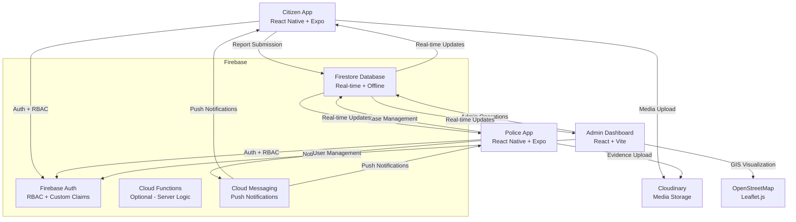

# Community Crime Reporting System (CCRS) - Project Overview

> **A comprehensive digital platform for community crime reporting, police case management, and administrative oversight**  
> Built with modern web and mobile technologies, prioritizing citizen safety and streamlined law enforcement operations.

---

## 📋 Table of Contents

1. [Project Description](#-project-description)
2. [System Architecture](#-system-architecture)
3. [Technology Stack](#-technology-stack)
4. [Applications Overview](#-applications-overview)
5. [Data Models & Firebase Integration](#-data-models--firebase-integration)
6. [Development Setup](#-development-setup)
7. [Firebase Free Tier Compliance](#-firebase-free-tier-compliance)
8. [Security & RBAC Implementation](#-security--rbac-implementation)
9. [Key Features](#-key-features)
10. [Project Structure](#-project-structure)
11. [Future Roadmap](#-future-roadmap)

---

## 🎯 Project Description

The **Community Crime Reporting System (CCRS)** is a comprehensive digital platform designed to bridge the gap between citizens and law enforcement in the Philippines, specifically targeting the Pangasinan province. The system empowers citizens to report crimes and incidents through a user-friendly mobile application, while providing police officers and administrators with powerful tools to manage, investigate, and resolve cases efficiently.

### Core Value Proposition
- **Citizens** can securely report crimes with multimedia evidence, location data, and real-time status updates
- **Police Officers** receive instant notifications for case assignments, can collect evidence on-site, and update case status in real-time
- **Administrators** have comprehensive oversight with analytics dashboards, user management, and GIS mapping capabilities

### Target Users
- **Citizens**: Community members reporting crimes, incidents, and emergencies
- **Police Officers**: First responders and investigators handling case assignments
- **Supervisors**: Unit leaders managing officer workloads and case approvals
- **System Administrators**: Platform managers overseeing users, reports, and system analytics

---

## 🏗️ System Architecture

The CCRS follows a modern, Firebase-centric architecture with three client applications communicating through a unified backend:



### Data Flow Overview
1. **Citizens** submit reports through the mobile app with optional multimedia and GPS location
2. **Firebase Firestore** stores all report data with real-time synchronization
3. **Police Officers** receive push notifications for new assignments via Firebase Cloud Messaging
4. **Evidence collection** uploads directly to Cloudinary with metadata stored in Firestore
5. **Administrators** monitor system-wide analytics and manage users through the web dashboard
6. **Real-time updates** propagate across all applications using Firestore listeners

---

## 🛠️ Technology Stack

### Frontend Frameworks
```typescript
// React Native + Expo (Mobile Apps)
"expo": "~53.0.22"
"react": "19.0.0"
"react-native": "0.79.6"
"expo-router": "~5.1.5"

// React + Vite (Admin Dashboard)  
"react": "^19.1.1"
"react-dom": "^19.1.1"
"vite": "^7.1.2"
"react-router-dom": "^7.8.2"
```

### UI & Styling
- **Mobile**: React Native core components with custom UI library
- **Web**: React Bootstrap 5 with CSS custom properties for theming
- **Charts**: Recharts for analytics and data visualization
- **Icons**: Phosphor React for consistent iconography throughout all applications
- **Maps**: Leaflet.js with React-Leaflet for GIS visualization

### Backend & Data
```typescript
// Firebase Services (Spark Tier Compliant)
"firebase": "^12.2.1"
// - Authentication with custom claims for RBAC
// - Firestore for real-time database
// - Cloud Messaging for push notifications
// - Storage integration via Cloudinary
```

### Development Tools
- **TypeScript**: Strict type checking across all applications
- **ESLint**: Code quality enforcement with React-specific rules  
- **Expo CLI**: Mobile development and testing
- **Vite**: Fast web development with HMR

### External Services
- **Cloudinary**: Media storage and optimization (free tier)
- **OpenStreetMap**: Map tiles and geographic data
- **Expo Push Notifications**: Mobile push notification delivery

---

## 📱 Applications Overview

### Admin Dashboard (`admin/`)
**Platform**: Web Application (React + Vite)  
**Target Users**: System Administrators, Supervisors  

#### Core Features
- **Dashboard Overview**: Real-time KPI cards showing user statistics, report counts by status, and system health metrics
- **Report Management**: Comprehensive table with advanced filtering, status updates, bulk operations, and detailed modal views
- **GIS Map Integration**: Interactive Leaflet map with crime report visualization, heatmaps, clustering, and temporal analysis
- **User Administration**: User search, role management (Admin/Supervisor/Citizen), account controls, and activity tracking
- **Analytics**: Recharts-powered dashboards showing crime trends, category distributions, and performance metrics

#### Key Screens
- `/dashboard` - KPI overview with charts and recent activity
- `/reports` - Report management table with map view toggle
- `/users` - User administration with role-based filtering
- `/login` - Administrative authentication

#### Dependencies
```json
{
  "bootstrap": "^5.3.8",
  "react-bootstrap": "^2.10.10", 
  "recharts": "^3.1.2",
  "phosphor-react": "^1.4.1",
  "leaflet": "^1.9.4",
  "react-leaflet": "^5.0.0"
}
```

---

### Police/Officer App (`police/`)
**Platform**: Mobile Application (React Native + Expo)  
**Target Users**: Police Officers, Unit Supervisors

#### Core Features
- **Assignment Inbox**: Real-time list of assigned cases with priority indicators, location data, and quick actions
- **Case Detail Management**: Complete case information with evidence gallery, location maps, and status transitions
- **Evidence Collection**: On-site photo, video, and audio capture with automatic metadata and geolocation
- **Status Workflow**: Accept/decline assignments, mark responding, resolve/reject with detailed notes
- **Officer Analytics**: Personal performance metrics and unit-level insights using Recharts
- **Push Notifications**: Instant alerts for new assignments and status updates

#### Key Screens
- Assignment Inbox - List of assigned cases with status and priority
- Case Detail - Full case information with evidence and actions
- Evidence Capture - Camera/media picker with upload queue
- Analytics - Officer performance and unit dashboards

#### Dependencies
```json
{
  "expo-image-picker": "^16.1.4",
  "expo-notifications": "^0.32.10",
  "expo-location": "^18.1.6",
  "react-leaflet": "^5.0.0",
  "expo-video": "~2.2.2",
  "expo-audio": "~0.4.9"
}
```

---

### Citizen App (`newlogin/`)
**Platform**: Mobile Application (React Native + Expo)  
**Target Users**: Community Members, Citizens

#### Core Features
- **Multi-Authentication**: Email/password, phone OTP (planned), and anonymous reporting options
- **Crime Reporting**: Intuitive form with category selection, multimedia upload, and GPS location capture
- **Report History**: Personal dashboard showing submitted reports with real-time status updates
- **Report Timeline**: Detailed view of case progress with status changes and official updates
- **Media Management**: Photo and video capture with Cloudinary integration and automatic compression
- **Offline Support**: Queue submissions when offline with automatic sync

#### Key Screens
- `/auth/login` - Multi-method authentication
- `/(tabs)/index` - Main reporting form
- `/(tabs)/history` - User's report history
- `/report-detail` - Detailed report view with timeline

#### Dependencies
```json
{
  "expo-image-picker": "^16.1.4", 
  "expo-location": "^18.1.6",
  "expo-camera": "^16.1.11",
  "cloudinary": "^2.7.0",
  "zod": "^4.1.3"
}
```

---

## 🔄 Data Models & Firebase Integration

### Firebase Configuration
```typescript
// config/firebase.ts
import { initializeApp } from 'firebase/app';
import { getAuth } from 'firebase/auth';
import { getFirestore } from 'firebase/firestore';

const firebaseConfig = {
  apiKey: process.env.VITE_FIREBASE_API_KEY,
  authDomain: process.env.VITE_FIREBASE_AUTH_DOMAIN,
  projectId: process.env.VITE_FIREBASE_PROJECT_ID,
  storageBucket: process.env.VITE_FIREBASE_STORAGE_BUCKET,
  messagingSenderId: process.env.VITE_FIREBASE_MESSAGING_SENDER_ID,
  appId: process.env.VITE_FIREBASE_APP_ID
};

export const app = initializeApp(firebaseConfig);
export const auth = getAuth(app);
export const db = getFirestore(app);
```

### Core Firestore Collections

| Collection | Fields | Security Rules | Purpose |
|------------|---------|----------------|---------|
| `reports` | `id`, `user_id`, `mainCategory`, `category`, `description`, `media_urls[]`, `location`, `status`, `priority`, `assignedTo`, `officerNotes[]`, `timestamp`, `updatedAt` | Citizens can create/read own reports; Officers can update assigned reports; Admins have full access | Crime reports with multimedia evidence |
| `users` | `id`, `email`, `name`, `phoneNumber`, `role`, `status`, `authMethod`, `isPhoneVerified`, `createdAt`, `updatedAt`, `lastLoginAt` | Users can read/update own profile; Admins can manage all users | User profiles and authentication data |
| `report_evidence` | `id`, `reportId`, `type`, `url`, `publicId`, `authorUid`, `metadata`, `createdAt` | Officers can create evidence for assigned reports; Read access for relevant parties | Evidence attachments subcollection |
| `audit_logs` | `id`, `adminUserId`, `adminEmail`, `action`, `targetType`, `targetId`, `details`, `timestamp` | Admin-only read access; System writes | System audit trail and compliance |
| `officers` | `id`, `pushToken`, `unit`, `badge`, `rank`, `status` | Officer profile data for push notifications | Extended officer information |

### Firebase Auth Role Mapping
```typescript
interface AuthUser {
  uid: string;
  email?: string;
  role?: 'citizen' | 'officer' | 'supervisor' | 'admin';
  status?: 'active' | 'inactive' | 'suspended';
  isAnonymous: boolean;
}

// Custom Claims Structure
{
  role: 'admin' | 'supervisor' | 'officer' | 'citizen',
  status: 'active' | 'inactive' | 'suspended'
}
```

---

## 🚀 Development Setup

### Prerequisites
- **Node.js**: Version 18+ (LTS recommended)
- **npm**: Version 9+ or **pnpm** for faster installs
- **Git**: For version control
- **Expo CLI**: `npm install -g @expo/cli`
- **Firebase Project**: Created with Authentication, Firestore, and Cloud Messaging enabled
- **Cloudinary Account**: For media storage (free tier sufficient)

### Environment Configuration

#### Root `.env` (Shared)
```bash
# Firebase Configuration
VITE_FIREBASE_API_KEY=your_api_key
VITE_FIREBASE_AUTH_DOMAIN=your_project.firebaseapp.com
VITE_FIREBASE_PROJECT_ID=your_project_id
VITE_FIREBASE_STORAGE_BUCKET=your_project.appspot.com
VITE_FIREBASE_MESSAGING_SENDER_ID=your_sender_id
VITE_FIREBASE_APP_ID=your_app_id

# Cloudinary Configuration
EXPO_PUBLIC_CLOUDINARY_CLOUD_NAME=your_cloud_name
EXPO_PUBLIC_CLOUDINARY_UPLOAD_PRESET=your_unsigned_preset

# Optional
EXPO_PUBLIC_EAS_PROJECT_ID=your-expo-project-id
```

### Installation & Running

#### Admin Dashboard
```bash
cd admin
npm install
cp .env.example .env  # Configure Firebase credentials
npm run dev          # Start development server on http://localhost:5173
npm run build        # Production build
npm run preview      # Preview production build
```

#### Police App
```bash
cd police
npm install
cp .env.example .env  # Configure environment
npx expo start       # Start Expo development server
npx expo run:android # Run on Android
npx expo run:ios     # Run on iOS
```

#### Citizen App
```bash
cd newlogin
npm install  
cp .env.example .env  # Configure environment
npx expo start       # Start Expo development server
```

### Firebase Setup
1. Create a new Firebase project at https://console.firebase.google.com
2. Enable Authentication with Email/Password and Anonymous providers
3. Create Firestore database in production mode
4. Set up security rules (see `police/firestore.rules` - unified rules for all three applications)
5. Enable Cloud Messaging for push notifications
6. Download configuration files:
   - Web: Add config to environment variables
   - Android: Download `google-services.json` to mobile app directories
   - iOS: Download `GoogleService-Info.plist` to iOS directories

---

## 💰 Firebase Free Tier Compliance

The CCRS is designed to operate within Firebase's **Spark (Free) Plan** limitations:

### Firestore Limits Management
- **Read/Write Operations**: Client-side aggregation prevents excessive queries
- **Storage**: Media files stored in Cloudinary, only metadata in Firestore  
- **Real-time Listeners**: Optimized with TTL caching to reduce continuous reads
- **Indexing Strategy**: Minimal composite indexes for essential queries only

### Cost Optimization Strategies
```typescript
// Client-side aggregation example
const getDashboardStats = async (): Promise<DashboardStats> => {
  const reportsSnapshot = await getDocs(collection(db, 'reports'));
  const usersSnapshot = await getDocs(collection(db, 'users'));
  
  // Aggregate on client to avoid Cloud Functions costs
  return {
    totalReports: reportsSnapshot.size,
    totalUsers: usersSnapshot.size,
    // ... computed statistics
  };
};
```

### Free Tier Compliance Features
- **No Cloud Functions Required**: All business logic runs on client
- **Batched Operations**: Minimize individual write operations  
- **Image Compression**: Automatic media optimization before upload
- **Offline Caching**: Reduce redundant network requests
- **Query Optimization**: Precise queries with minimal data transfer

---

## 🔒 Security & RBAC Implementation

### Role-Based Access Control Matrix

| Feature | Citizen | Officer | Supervisor | Admin |
|---------|---------|---------|------------|-------|
| Submit Reports | ✅ | ❌ | ❌ | ❌ |
| View Own Reports | ✅ | ❌ | ❌ | ✅ |
| Accept/Decline Cases | ❌ | ✅ | ✅ | ✅ |
| Update Case Status | ❌ | ✅ | ✅ | ✅ |
| Collect Evidence | ❌ | ✅ | ✅ | ✅ |
| Reassign Cases | ❌ | ❌ | ✅ | ✅ |
| User Management | ❌ | ❌ | ❌ | ✅ |
| System Analytics | ❌ | Personal Only | Unit Only | Full Access |
| Audit Logs | ❌ | ❌ | Limited | ✅ |

### Unified Firestore Security Rules

The project uses a **unified Firestore rules file** located at `police/firestore.rules` that governs security for all three applications. This centralized approach ensures consistent RBAC enforcement across the citizen app, police app, and admin dashboard.

**Key Features of the Unified Rules:**
- **Dual Role Resolution**: Supports both Firebase custom claims and Firestore user document fallback
- **Granular Permissions**: Different access levels for citizens, officers, supervisors, and admins
- **Evidence Chain of Custody**: Immutable evidence collection with proper access controls
- **Audit Trail Protection**: Append-only audit logs with restricted access
- **Anonymous Support**: Secure anonymous reporting with proper user_id validation

```javascript
// police/firestore.rules (unified for all apps)
rules_version = '2';

service cloud.firestore {
  match /databases/{database}/documents {
    // Helper: role check via custom auth claims OR users doc
    function hasRole(role) {
      return request.auth != null && (
        (request.auth.token.role != null && request.auth.token.role == role) ||
        (exists(/databases/$(database)/documents/users/$(request.auth.uid)) &&
         get(/databases/$(database)/documents/users/$(request.auth.uid)).data.role == role)
      );
    }
    
    // Reports collection with comprehensive access control
    match /reports/{reportId} {
      // Citizens can create reports they own
      allow create: if request.auth != null &&
                    isValidReportCreate(request.resource.data) &&
                    (request.resource.data.user_id == request.auth.uid ||
                     request.auth.token.firebase.sign_in_provider == 'anonymous');
      
      // Unified read access for owner, assigned officer, supervisors, and admins
      allow read: if request.auth != null && (
        resource.data.user_id == request.auth.uid ||
        resource.data.assignedTo == request.auth.uid ||
        hasRole('supervisor') || hasRole('admin')
      );
      
      // Officers can update assigned reports with valid state transitions
      allow update: if request.auth != null &&
                    hasRole('officer') &&
                    resource.data.assignedTo == request.auth.uid &&
                    validStatusTransition(resource.data, request.resource.data);
      
      // Supervisors and admins have full access
      allow read, update: if hasRole('supervisor');
      allow read, update, delete: if hasRole('admin');
    }
    
    // Evidence subcollection with chain of custody
    match /reports/{reportId}/report_evidence/{evidenceId} {
      // Officers assigned to the report can create evidence
      allow read, create: if request.auth != null &&
                         get(/databases/$(database)/documents/reports/$(reportId)).data.assignedTo == request.auth.uid &&
                         (hasRole('officer') || hasRole('supervisor'));
      
      // Evidence is immutable once created
      allow update, delete: if false;
    }
  }
}
```

### Authentication Flow
```typescript
// Custom claims validation in AuthContext
useEffect(() => {
  const unsubscribe = onAuthStateChanged(auth, async (user) => {
    if (user) {
      const tokenResult = await user.getIdTokenResult();
      const role = tokenResult.claims.role as UserRole;
      const status = tokenResult.claims.status as UserStatus;
      
      // Role-based navigation and UI restrictions
      setUserRole(role);
      setUserStatus(status);
    }
  });
  return unsubscribe;
}, []);
```

---

## ⭐ Key Features

### 🔄 Real-time Crime Reporting
- **Instant Submission**: Citizens can report crimes immediately with multimedia evidence
- **Live Status Updates**: Real-time notifications on case progress across all platforms
- **Anonymous Reporting**: Privacy-focused option for sensitive cases
- **Geolocation Integration**: Automatic GPS capture with reverse geocoding

### 📸 Multimedia Evidence Management  
- **Multi-format Support**: Photos, videos, and audio recordings
- **Cloudinary Integration**: Professional media storage with automatic optimization
- **Chain of Custody**: Immutable evidence logging with timestamps and officer verification
- **Offline Queueing**: Evidence upload retry with background synchronization

### 🗺️ GIS Mapping & Visualization
- **Interactive Crime Maps**: Leaflet-powered visualization with OpenStreetMap tiles
- **Heatmap Analysis**: Crime density visualization for pattern identification  
- **Cluster Mapping**: Grouped incident display for better overview
- **Temporal Analysis**: Time-based playback of crime incidents

### 📊 Analytics & Dashboards
- **Recharts Integration**: Professional charts following user preference guidelines
- **Real-time KPIs**: Live statistics on reports, response times, and resolution rates
- **Performance Metrics**: Officer productivity and case resolution tracking
- **Trend Analysis**: Category-based crime pattern identification

### 🔔 Push Notification System
- **Firebase Cloud Messaging**: Reliable cross-platform notifications
- **Role-based Alerts**: Targeted notifications based on user roles and assignments  
- **Local Notifications**: Offline-capable alerts for critical updates
- **Custom Channels**: Android notification channels for different alert types

### 💾 Offline Support & Caching
- **AsyncStorage Integration**: Persistent local data for offline access
- **TTL Caching**: Time-based cache invalidation for fresh data
- **Queue Management**: Offline action queuing with automatic retry
- **Conflict Resolution**: Smart merging of offline and online data changes

### ♿ Accessibility & UX
- **WCAG 2.1 AA Compliance**: Accessible design for all users
- **Phosphor Icons**: Consistent, professional iconography across all apps
- **Responsive Design**: Mobile-first approach with desktop optimization  
- **Theme Support**: Light/dark mode with user preference persistence

---

## 📁 Project Structure

```
ccrs-test/
├── admin/                          # Web Admin Dashboard
│   ├── src/
│   │   ├── components/             # Reusable UI components
│   │   │   ├── ui/                 # Base component library  
│   │   │   ├── charts/             # Recharts visualizations
│   │   │   ├── reports/            # Report-specific components
│   │   │   └── map/                # GIS mapping components
│   │   ├── pages/                  # Main application pages
│   │   │   ├── Dashboard.tsx       # Analytics overview
│   │   │   ├── Reports.tsx         # Report management
│   │   │   ├── Users.tsx           # User administration
│   │   │   └── Login.tsx           # Authentication
│   │   ├── services/               # API and Firebase services
│   │   │   ├── firebaseService.ts  # Firestore operations
│   │   │   ├── auditService.ts     # Audit logging
│   │   │   └── rbacService.ts      # Role management
│   │   ├── contexts/               # React Context providers
│   │   └── hooks/                  # Custom React hooks
│   ├── package.json
│   └── vite.config.ts
│
├── police/                         # Mobile Police App
│   ├── app/                        # Expo Router pages
│   │   ├── (tabs)/                 # Tab navigation
│   │   └── analytics.tsx           # Officer analytics
│   ├── screens/                    # Main screen components  
│   │   ├── AssignmentInboxScreen.tsx
│   │   ├── ReportDetailScreen.tsx
│   │   └── OfficerAnalyticsScreen.tsx
│   ├── services/                   # Firebase and external services
│   │   ├── firestoreService.ts     # Database operations
│   │   ├── evidenceService.ts      # Cloudinary integration
│   │   ├── notificationService.ts  # Push notifications
│   │   └── authService.ts          # Authentication
│   ├── contexts/                   # React Context providers
│   ├── components/                 # Reusable components
│   ├── app.json                    # Expo configuration
│   └── package.json
│
├── newlogin/                       # Mobile Citizen App  
│   ├── app/                        # Expo Router pages
│   │   ├── (tabs)/                 # Main app tabs
│   │   │   ├── index.tsx           # Report submission
│   │   │   ├── history.tsx         # Report history
│   │   │   └── profile.tsx         # User profile
│   │   ├── auth/                   # Authentication screens
│   │   │   ├── login.tsx
│   │   │   ├── register.tsx
│   │   │   └── verify-otp.tsx
│   │   └── report-detail.tsx       # Individual report view
│   ├── components/                 # UI component library
│   │   ├── ui/                     # Base components
│   │   └── auth/                   # Auth-specific components
│   ├── services/                   # Backend integration
│   │   ├── reportService.ts        # Report CRUD operations
│   │   ├── firebaseService.ts      # Firebase utilities
│   │   ├── locationService.ts      # GPS and geocoding  
│   │   └── mediaService.ts         # Cloudinary integration
│   ├── contexts/                   # State management
│   │   ├── AuthContext.tsx
│   │   ├── AlertContext.tsx  
│   │   └── ThemeContext.tsx
│   ├── app.json                    # Expo configuration
│   └── package.json
│
├── shared-components/              # Cross-app shared components
│   └── RoleProtection.tsx
├── shared-types/                   # TypeScript type definitions
│   └── rbac.ts
├── .gitignore                      # Git ignore patterns
└── PROJECT_OVERVIEW.md             # This document
```

**Important**: The unified Firebase security rules are now centralized at the root level for all three applications.

### Monorepo Organization
- **Shared Resources**: Common types and components prevent code duplication
- **Independent Packages**: Each app maintains its own dependencies and build process  
- **Unified Firebase Rules**: Centralized security rules at root level (`firestore.rules`, `database.rules.json`) govern all three applications
- **Single Deployment**: Deploy all Firebase rules from root directory with `./deploy-firebase-rules.ps1`
- **Documentation**: Comprehensive project documentation and setup guides

---

## 🚀 Future Roadmap

### Phase 1: Core Platform Completion (Q1 2025)
- **Complete RBAC Implementation**: Finalize role-based permissions and custom claims
- **Enhanced Evidence Management**: Chain of custody tracking and evidence verification
- **Advanced Analytics**: Predictive analytics for crime patterns and response optimization
- **Performance Optimization**: Bundle size reduction, lazy loading, and caching improvements

### Phase 2: Advanced Features (Q2 2025)
- **Multi-language Support**: Internationalization for broader Philippines deployment
- **PWA Capabilities**: Offline-first web app with service worker support
- **Advanced GIS Features**: Crime prediction heatmaps and patrol route optimization
- **Integration APIs**: Third-party integrations for emergency services and government systems

### Phase 3: Scalability & Enterprise (Q3-Q4 2025)
- **Multi-tenant Architecture**: Support for multiple jurisdictions and organizations
- **Cloud Functions Migration**: Move to paid Firebase tier for advanced server-side features
- **Machine Learning Integration**: Automated case prioritization and pattern recognition
- **Compliance & Audit**: GDPR compliance, advanced audit trails, and regulatory reporting

### Technical Improvements
- **Testing Coverage**: Comprehensive unit, integration, and E2E testing suites
- **CI/CD Pipeline**: Automated testing, building, and deployment workflows  
- **Performance Monitoring**: Real-time performance analytics and error tracking
- **Security Hardening**: Advanced authentication methods and security audits

### Feature Enhancements
- **Voice-to-Text Reporting**: Speech recognition for hands-free report submission
- **AI-Powered Insights**: Smart case routing and resource allocation recommendations
- **Community Engagement**: Public safety announcements and community feedback features
- **Integration Ecosystem**: APIs for third-party developers and government services

---

## 📞 Contact & Documentation

**Project Repository**: CCRS Community Crime Reporting System  
**Technical Stack**: React Native, React.js, Firebase, TypeScript  
**Development Team**: Community Safety Technology Initiative  
**Documentation**: See individual app README files for detailed setup instructions

### Related Documentation
- `admin/PROJECT_OVERVIEW.md` - Detailed admin dashboard architecture
- `police/PRD.md` - Police app product requirements and features  
- `newlogin/README.md` - Citizen app setup and development guide
- `UNIFIED_FIREBASE_RULES_GUIDE.md` - Complete Firebase rules setup and deployment guide
- `firestore.rules` - Unified Firestore security rules for all applications
- `database.rules.json` - Realtime Database rules for notification system

---

**Last Updated**: September 2025  
**Document Version**: 2.0 (Unified Firebase Rules + Notification System)  
**Next Review**: December 2025

---

*This project demonstrates modern full-stack development with React/React Native, Firebase, and TypeScript, prioritizing user experience, security, and scalability while adhering to best practices for mobile and web development.*
