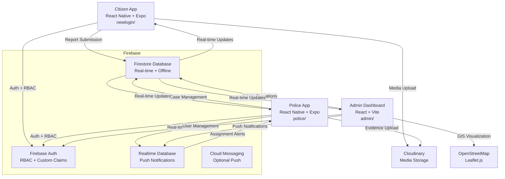

# Centralized Crime Reporting System for the Province of Pangasinan

> **A comprehensive digital platform bridging citizens and law enforcement through secure crime reporting, real-time case management, and administrative oversight**  
> Built with modern web and mobile technologies, prioritizing public safety and streamlined police operations.

---

## 📋 Table of Contents

1. [Project Description](#-project-description)
2. [System Architecture](#%EF%B8%8F-system-architecture)
3. [Technology Stack](#-technology-stack)
4. [Applications Overview](#-applications-overview)
5. [Data Models & Firebase Integration](#-data-models--firebase-integration)
6. [Security & RBAC Implementation](#-security--rbac-implementation)
7. [Key Features](#-key-features)
8. [Firebase Free Tier Compliance](#-firebase-free-tier-compliance)
9. [Development Setup](#-development-setup)
10. [Project Structure](#-project-structure)
11. [Shared Resources](#-shared-resources)
12. [Future Roadmap](#-future-roadmap)

---

## 🎯 Project Description

The **Centralized Crime Reporting System (CCRS)** is a comprehensive digital platform specifically designed for the Province of Pangasinan, Philippines. It creates a seamless connection between citizens and law enforcement agencies, enabling secure crime reporting, efficient case management, and transparent administrative oversight.

### Core Value Proposition

- **Citizens**: Report crimes instantly with multimedia evidence, GPS location, and track status in real-time
- **Police Officers**: Receive immediate assignment notifications, collect on-site evidence, and update cases with full accountability
- **Administrators**: Monitor system-wide analytics, manage users/roles, and oversee case workflows through GIS visualization

### Target Users

- **Citizens**: Community members reporting crimes, incidents, and emergencies (authenticated or anonymous)
- **Police Officers**: First responders handling case assignments and evidence collection
- **Supervisors**: Unit leaders managing officer workloads and case closure approvals
- **System Administrators**: Platform managers overseeing users, reports, and system analytics

### Problem Statement

Traditional crime reporting in the Philippines often suffers from:
- Lengthy bureaucratic processes requiring physical visits to police stations
- Limited evidence collection capabilities
- Poor transparency in case progress tracking
- Inefficient assignment and workload distribution among officers
- Lack of real-time coordination between citizens and law enforcement

---

## 🏗️ System Architecture

The CCRS follows a Firebase-centric client-server architecture with three applications communicating through unified backend services:



### Data Flow Overview

1. **Citizens** submit reports through mobile app with multimedia and GPS location
2. **Firebase Firestore** stores all report data with real-time synchronization
3. **Administrators** triage reports, set priorities, and assign to officers
4. **Firebase Realtime Database** delivers instant notifications to police officers
5. **Police Officers** accept assignments, collect evidence, and update case status
6. **Evidence collection** uploads to Cloudinary with metadata stored in Firestore
7. **Real-time updates** propagate across all applications using Firebase listeners

---

## 🛠️ Technology Stack

### Frontend Frameworks

| Layer | Technology | Version | Usage |
|-------|-----------|---------|-------|
| **Mobile Apps** | React Native + Expo | `~53.0.22` | Citizen & Police Apps |
| **Web Dashboard** | React + Vite | `^19.1.1` | Admin Dashboard |
| **Routing** | Expo Router / React Router | `~5.1.5` / `^7.8.2` | Navigation |

### UI & Styling

| Component | Technology | Purpose |
|-----------|-----------|---------|
| **Mobile UI** | React Native Core + Custom Library | Native mobile components |
| **Web UI** | React Bootstrap 5 | Responsive web interface |
| **Charts** | Recharts | Analytics and data visualization |
| **Icons** | Phosphor React | Consistent iconography |
| **Maps** | Leaflet.js + React-Leaflet | GIS visualization |

### Backend & Data

```typescript
// Firebase Configuration (Spark Tier Compliant)
"firebase": "^12.2.1"
// Services Used:
// - Authentication with custom claims for RBAC
// - Firestore for real-time database
// - Realtime Database for notifications
// - Storage integration via Cloudinary
```

### Development Tools

- **TypeScript**: Strict type checking across all applications
- **ESLint**: Code quality enforcement with React-specific rules
- **Expo CLI**: Mobile development and testing
- **Vite**: Fast web development with HMR

### External Services

- **Cloudinary**: Media storage and optimization (free tier)
- **OpenStreetMap**: Map tiles and geographic data
- **Expo Push Notifications**: Mobile notification delivery

---

## 📱 Applications Overview

### Citizen App (`newlogin/`)
**Platform**: Mobile Application (React Native + Expo)  
**Target Users**: Community Members, Citizens

#### Core Features
- **Multi-Authentication**: Email/password, anonymous reporting options
- **Crime Reporting**: Structured form with category selection, multimedia upload, GPS location
- **Report History**: Personal dashboard with real-time status updates
- **Report Timeline**: Detailed case progress tracking
- **Offline Support**: Queue submissions when offline with auto-sync

#### Key Screens
```
app/
├── (tabs)/
│   ├── index.tsx      # Main reporting form
│   ├── history.tsx    # User's report history
│   └── profile.tsx    # User profile management
├── auth/
│   ├── login.tsx      # Authentication
│   ├── register.tsx   # User registration
│   └── verify-otp.tsx # OTP verification
└── report-detail.tsx  # Detailed report view
```

#### Dependencies
```json
{
  "expo-image-picker": "^16.1.4",
  "expo-location": "^18.1.6",
  "expo-camera": "^16.1.11",
  "cloudinary": "^2.7.0",
  "firebase": "^12.1.0",
  "zod": "^4.1.3"
}
```

---

### Police App (`police/`)
**Platform**: Mobile Application (React Native + Expo)  
**Target Users**: Police Officers, Unit Supervisors

#### Core Features
- **Assignment Inbox**: Real-time list of assigned cases with priority indicators
- **Case Management**: Complete case information with evidence gallery and status workflow
- **Evidence Collection**: On-site photo, video, and audio capture with geolocation
- **Status Workflow**: Accept/decline assignments, mark responding, resolve with notes
- **Analytics**: Officer performance metrics using Recharts
- **Push Notifications**: Instant assignment alerts via Firebase Realtime Database

#### Key Screens
```
app/ & screens/
├── AssignmentInboxScreen.tsx     # List of assigned cases
├── ReportDetailScreen.tsx        # Case details and actions
├── InviteActivationScreen.tsx    # Officer onboarding
└── OfficerAnalyticsScreen.tsx    # Performance dashboards
```

#### Dependencies
```json
{
  "expo-notifications": "^0.32.10",
  "expo-image-picker": "^16.1.4",
  "expo-audio": "~0.4.9",
  "expo-video": "~2.2.2",
  "react-leaflet": "^5.0.0",
  "firebase": "^12.2.1"
}
```

---

### Admin Dashboard (`admin/`)
**Platform**: Web Application (React + Vite)  
**Target Users**: System Administrators, Supervisors

#### Core Features
- **Dashboard Overview**: Real-time KPI cards with system statistics
- **Report Management**: Advanced filtering, bulk operations, status updates
- **GIS Map Integration**: Interactive Leaflet maps with crime visualization
- **User Administration**: Role management and account controls
- **Analytics**: Recharts-powered dashboards for trend analysis
- **Officer Assignment**: Manual and automated assignment algorithms

#### Key Screens
```
src/pages/
├── Dashboard.tsx    # KPI overview and charts
├── Reports.tsx      # Report management table
├── Users.tsx        # User administration
└── Login.tsx        # Administrative authentication
```

#### Dependencies
```json
{
  "bootstrap": "^5.3.8",
  "react-bootstrap": "^2.10.10",
  "recharts": "^3.1.2",
  "phosphor-react": "^1.4.1",
  "leaflet": "^1.9.4",
  "react-leaflet": "^5.0.0",
  "firebase": "^12.2.1"
}
```

---

## 🔄 Data Models & Firebase Integration

### Firebase Configuration
```typescript
// config/firebase.ts
import { initializeApp } from 'firebase/app';
import { getAuth } from 'firebase/auth';
import { getFirestore } from 'firebase/firestore';
import { getDatabase } from 'firebase/database';

const firebaseConfig = {
  apiKey: process.env.VITE_FIREBASE_API_KEY,
  authDomain: process.env.VITE_FIREBASE_AUTH_DOMAIN,
  projectId: process.env.VITE_FIREBASE_PROJECT_ID,
  databaseURL: process.env.VITE_FIREBASE_DATABASE_URL,
  // ... other config
};

export const app = initializeApp(firebaseConfig);
export const auth = getAuth(app);
export const db = getFirestore(app);
export const rtdb = getDatabase(app);
```

### Core Firestore Collections

| Collection | Purpose | Key Fields | Security |
|------------|---------|------------|-----------|
| `reports/{id}` | Crime reports with evidence | `user_id`, `category`, `status`, `assignedTo`, `location`, `media_urls` | Citizens create own; Officers update assigned; Admins full access |
| `users/{uid}` | User profiles and roles | `email`, `role`, `status`, `jurisdictionId`, `isPhoneVerified` | Users read/update own; Admins manage all |
| `report_evidence/{id}` | Evidence subcollection | `reportId`, `type`, `url`, `authorUid`, `metadata` | Officers create for assigned cases; Immutable after creation |
| `officers/{uid}` | Officer-specific data | `pushToken`, `lastTokenUpdate`, `declineCount` | Officers update own push tokens |
| `audit_logs/{id}` | System audit trail | `adminUserId`, `action`, `targetType`, `details` | Admin-only read; System writes |
| `invites/{id}` | Officer invitation system | `email`, `role`, `status`, `inviteCode`, `expiresAt` | Admin creates; Officers accept |
| `notifications/{uid}` | Real-time notifications | `title`, `body`, `data`, `delivered`, `seen` | Officers read own; Admins write |

### Data Model Relationships
```typescript
// Unified Report Interface
interface CCRSReport {
  id: string;
  user_id?: string | null;
  mainCategory: 'crime' | 'child_abuse' | 'women_abuse' | 'other';
  category: string;
  description: string;
  status: 'pending' | 'assigned' | 'accepted' | 'responding' | 'resolved' | 'rejected';
  priority?: 'low' | 'medium' | 'high' | 'critical';
  assignedTo?: string;
  assignmentStatus?: 'pending' | 'accepted' | 'declined';
  location?: {
    latitude: number;
    longitude: number;
    address?: DetailedAddress;
    accuracy?: number;
  };
  media_urls?: string[];
  officerNotes?: Array<{ note: string; author: string; timestamp: Date }>;
  resolutionNotes?: string;
  timestamp: Date;
  updatedAt: Date;
  submission_type: 'anonymous' | 'authenticated';
}
```

---

## 🔒 Security & RBAC Implementation

### Role Hierarchy

| Role | Purpose | Permissions |
|------|---------|-------------|
| **Citizen** | Report submitters | Create reports, view own submissions |
| **Officer** | Case handlers | Accept assignments, update case status, collect evidence |
| **Supervisor** | Unit managers | Reassign cases, approve closures, manage officers |
| **Admin** | System managers | Full system access, user management, analytics |

### Permission Matrix

| Action | Citizen | Officer | Supervisor | Admin |
|--------|---------|---------|------------|-------|
| Submit Reports | ✅ | ❌ | ❌ | ❌ |
| View Own Reports | ✅ | ❌ | ❌ | ✅ |
| Accept/Decline Cases | ❌ | ✅ | ✅ | ✅ |
| Update Case Status | ❌ | ✅ (assigned only) | ✅ | ✅ |
| Collect Evidence | ❌ | ✅ | ✅ | ✅ |
| Reassign Cases | ❌ | ❌ | ✅ | ✅ |
| User Management | ❌ | ❌ | ❌ | ✅ |
| System Analytics | ❌ | Personal only | Unit only | Full access |

### Unified Firestore Security Rules

The project uses a **unified security rules file** (`police/firestore.rules`) that governs all three applications:

```javascript
rules_version = '2';
service cloud.firestore {
  match /databases/{database}/documents {
    // Role validation via custom claims OR user document
    function hasRole(role) {
      return request.auth != null && (
        (request.auth.token.role != null && request.auth.token.role == role) ||
        (exists(/databases/$(database)/documents/users/$(request.auth.uid)) &&
         get(/databases/$(database)/documents/users/$(request.auth.uid)).data.role == role)
      );
    }
    
    // Reports collection with comprehensive access control
    match /reports/{reportId} {
      // Citizens can create reports they own
      allow create: if request.auth != null &&
                    isValidReportCreate(request.resource.data) &&
                    (request.resource.data.user_id == request.auth.uid ||
                     request.auth.token.firebase.sign_in_provider == 'anonymous');
      
      // Unified read access for owner, assigned officer, supervisors, admins
      allow read: if request.auth != null && (
        resource.data.user_id == request.auth.uid ||
        resource.data.assignedTo == request.auth.uid ||
        hasRole('supervisor') || hasRole('admin')
      );
      
      // Officers can update assigned reports with valid state transitions
      allow update: if request.auth != null &&
                    hasRole('officer') &&
                    resource.data.assignedTo == request.auth.uid &&
                    validStatusTransition(resource.data, request.resource.data);
      
      // Admins and supervisors have elevated access
      allow read, update: if hasRole('supervisor');
      allow read, update, delete: if hasRole('admin');
    }
    
    // Evidence subcollection - immutable chain of custody
    match /reports/{reportId}/report_evidence/{evidenceId} {
      allow read, create: if request.auth != null &&
                         get(/databases/$(database)/documents/reports/$(reportId)).data.assignedTo == request.auth.uid &&
                         (hasRole('officer') || hasRole('supervisor'));
      // Evidence is immutable once created
      allow update, delete: if false;
    }
  }
}
```

---

## ⭐ Key Features

### 🔄 Real-time Crime Reporting
- **Instant Submission**: Citizens report crimes with multimedia evidence and GPS coordinates
- **Anonymous Option**: Privacy-focused reporting for sensitive cases
- **Status Tracking**: Live updates on case progress across all platforms
- **Multimedia Support**: Photos, videos, and audio recordings with metadata

### 📱 Push Notification System
- **Firebase Realtime Database**: Instant notification delivery bypassing network restrictions
- **Local Notifications**: Device-level alerts for critical updates
- **Role-based Targeting**: Notifications specific to user roles and assignments
- **Delivery Tracking**: Confirmation of message receipt and read status

### 🗺️ GIS Mapping & Visualization
- **Interactive Crime Maps**: Leaflet-powered visualization with OpenStreetMap
- **Heatmap Analysis**: Crime density patterns for strategic planning
- **Cluster Mapping**: Grouped incident display for better overview
- **Geolocation Integration**: Automatic GPS capture with reverse geocoding

### 📊 Analytics & Dashboards
- **Recharts Integration**: Professional data visualization following user preferences
- **Real-time KPIs**: Live statistics on response times and resolution rates
- **Performance Metrics**: Officer productivity and case tracking
- **Trend Analysis**: Category-based crime pattern identification

### 💾 Offline Support & Caching
- **AsyncStorage Integration**: Persistent local data for offline access
- **Queue Management**: Offline action queuing with automatic retry
- **Conflict Resolution**: Smart merging of offline and online data changes
- **Background Sync**: Automatic synchronization when connection restored

### 🔍 Evidence Management
- **Chain of Custody**: Immutable evidence logging with officer verification
- **Multi-format Support**: Photos, videos, audio recordings with metadata
- **Cloudinary Integration**: Professional media storage with optimization
- **Audit Trail**: Complete tracking of evidence collection and access

---

## 💰 Firebase Free Tier Compliance

**This system is specifically designed to operate within Firebase Spark (Free) Plan limitations**, strictly adhering to the user's Firebase free-tier rule:

### Cost Optimization Strategies

| Strategy | Implementation | Benefit |
|----------|----------------|---------|
| **No Cloud Functions** | All business logic runs on client-side | Avoids compute costs entirely |
| **Client-side Aggregation** | Dashboard statistics computed in browser/app | Reduces read operations |
| **Cloudinary Off-loading** | Media stored externally, only URLs in Firestore | Minimizes storage usage |
| **Batched Operations** | Grouped writes to reduce transaction costs | Optimizes write quota usage |
| **Listener Optimization** | TTL caching and selective subscriptions | Manages real-time read limits |

### Free Tier Compliance Examples

```typescript
// Client-side aggregation to avoid server compute
const getDashboardStats = async (): Promise<DashboardStats> => {
  const reportsSnapshot = await getDocs(collection(db, 'reports'));
  const usersSnapshot = await getDocs(collection(db, 'users'));
  
  // Compute statistics on client to stay within free tier
  return {
    totalReports: reportsSnapshot.size,
    totalUsers: usersSnapshot.size,
    pendingReports: reportsSnapshot.docs.filter(doc => 
      doc.data().status === 'pending'
    ).length,
    // ... other computed metrics
  };
};
```

### Avoided Paid Features
- ❌ Cloud Functions for server-side processing
- ❌ Cloud Run for containerized applications  
- ❌ Firebase Extensions marketplace add-ons
- ❌ Advanced ML APIs or paid hosting tiers
- ❌ Scheduled database maintenance jobs

---

## 🚀 Development Setup

### Prerequisites
- **Node.js**: Version 18+ (LTS recommended)
- **npm/pnpm**: Package manager
- **Expo CLI**: `npm install -g @expo/cli`
- **Firebase Project**: Authentication, Firestore, and Realtime Database enabled
- **Cloudinary Account**: For media storage (free tier)

### Environment Configuration

Create environment files in each application directory:

**Root `.env` (Shared Configuration)**
```bash
# Firebase Configuration
VITE_FIREBASE_API_KEY=your_api_key
VITE_FIREBASE_AUTH_DOMAIN=your_project.firebaseapp.com
VITE_FIREBASE_PROJECT_ID=your_project_id
VITE_FIREBASE_STORAGE_BUCKET=your_project.appspot.com
VITE_FIREBASE_MESSAGING_SENDER_ID=your_sender_id
VITE_FIREBASE_APP_ID=your_app_id
VITE_FIREBASE_DATABASE_URL=https://your_project-default-rtdb.asia-southeast1.firebasedatabase.app

# Cloudinary Configuration
EXPO_PUBLIC_CLOUDINARY_CLOUD_NAME=your_cloud_name
EXPO_PUBLIC_CLOUDINARY_UPLOAD_PRESET=your_unsigned_preset

# Optional
EXPO_PUBLIC_EAS_PROJECT_ID=your-expo-project-id
```

### Installation & Running

#### Admin Dashboard
```bash
cd admin
npm install
cp .env.example .env    # Configure Firebase credentials
npm run dev            # Start development server on http://localhost:5173
npm run build          # Production build
```

#### Police App
```bash
cd police
npm install
cp .env.example .env    # Configure environment
npx expo start         # Start Expo development server
npx expo run:android   # Run on Android device
npx expo run:ios       # Run on iOS device
```

#### Citizen App
```bash
cd newlogin
npm install
cp .env.example .env    # Configure environment
npx expo start         # Start Expo development server
```

### Firebase Setup Checklist

1. **Create Firebase Project** at https://console.firebase.google.com
2. **Enable Authentication**:
   - Email/Password provider
   - Anonymous provider
3. **Create Firestore Database** in production mode
4. **Enable Realtime Database** for notifications
5. **Deploy Security Rules**: Upload `police/firestore.rules`
6. **Download Configuration Files**:
   - Web: Copy config to environment variables
   - Android: Place `google-services.json` in mobile app root
   - iOS: Place `GoogleService-Info.plist` in iOS directory

---

## 📁 Project Structure

```
centralized-crime-reporting-system/
├── admin/                              # Web Admin Dashboard
│   ├── src/
│   │   ├── components/                 # Reusable UI components
│   │   │   ├── ui/                     # Base component library
│   │   │   ├── charts/                 # Recharts visualizations
│   │   │   ├── reports/                # Report-specific components
│   │   │   └── map/                    # GIS mapping components
│   │   ├── pages/                      # Main application pages
│   │   │   ├── Dashboard.tsx           # Analytics overview
│   │   │   ├── Reports.tsx             # Report management
│   │   │   ├── Users.tsx               # User administration
│   │   │   └── Login.tsx               # Authentication
│   │   ├── services/                   # API and Firebase services
│   │   │   ├── firebaseService.ts      # Firestore operations
│   │   │   ├── auditService.ts         # Audit logging
│   │   │   ├── rbacService.ts          # Role management
│   │   │   └── realtimePushService.ts  # Notification system
│   │   ├── contexts/                   # React Context providers
│   │   └── hooks/                      # Custom React hooks
│   ├── package.json
│   └── vite.config.ts
│
├── police/                             # Mobile Police App
│   ├── app/                            # Expo Router pages
│   │   ├── (tabs)/                     # Tab navigation
│   │   └── analytics.tsx               # Officer analytics
│   ├── screens/                        # Main screen components
│   │   ├── AssignmentInboxScreen.tsx   # Assignment management
│   │   ├── ReportDetailScreen.tsx      # Case details and actions
│   │   ├── InviteActivationScreen.tsx  # Officer onboarding
│   │   └── OfficerAnalyticsScreen.tsx  # Performance dashboards
│   ├── services/                       # Firebase and external services
│   │   ├── firestoreService.ts         # Database operations
│   │   ├── evidenceService.ts          # Evidence collection
│   │   ├── notificationService.ts      # Push notifications
│   │   ├── realtimeNotificationService.ts # Real-time alerts
│   │   └── authService.ts              # Authentication
│   ├── contexts/                       # React Context providers
│   ├── components/                     # Reusable components
│   ├── firestore.rules                 # Unified security rules
│   ├── firestore.indexes.json          # Database indexes
│   ├── app.json                        # Expo configuration
│   └── package.json
│
├── newlogin/                           # Mobile Citizen App
│   ├── app/                            # Expo Router pages
│   │   ├── (tabs)/                     # Main app tabs
│   │   │   ├── index.tsx               # Report submission form
│   │   │   ├── history.tsx             # Report history
│   │   │   └── profile.tsx             # User profile
│   │   ├── auth/                       # Authentication screens
│   │   │   ├── login.tsx               # User login
│   │   │   ├── register.tsx            # User registration
│   │   │   └── verify-otp.tsx          # OTP verification
│   │   └── report-detail.tsx           # Detailed report view
│   ├── contexts/                       # React Context providers
│   │   ├── AuthContext.tsx             # Authentication state
│   │   ├── AlertContext.tsx            # Global alerts
│   │   └── ThemeContext.tsx            # Theme management
│   ├── services/                       # Firebase and external services
│   │   ├── reportService.ts            # Report operations
│   │   ├── firebaseService.ts          # Database operations
│   │   ├── locationService.ts          # GPS and geocoding
│   │   └── mediaService.ts             # Cloudinary integration
│   ├── components/                     # Reusable components
│   │   └── ui/                         # UI component library
│   ├── types/                          # TypeScript definitions
│   ├── config/                         # Configuration files
│   ├── app.json                        # Expo configuration
│   └── package.json
│
├── shared-types/                       # Shared TypeScript definitions
│   └── rbac.ts                         # RBAC types and permissions
│
├── shared-components/                  # Shared React components
│   └── RoleProtection.tsx              # Role-based access control
│
├── PROJECT_OVERVIEW_UNIFIED.md         # This document
├── NOTIFICATION_SYSTEM.md              # Notification architecture
├── POLICE_ASSIGNMENT_ORCHESTRATION.md # Case workflow documentation
└── prd-police-assignment.md            # Product requirements
```

---

## 🔗 Shared Resources

### Shared Types (`shared-types/`)

The project includes centralized TypeScript definitions to ensure consistency across all applications:

```typescript
// shared-types/rbac.ts
export type UserRole = 'citizen' | 'officer' | 'supervisor' | 'admin';
export type UserStatus = 'active' | 'inactive' | 'suspended';

export interface CCRSUser {
  id: string;
  email?: string;
  role: UserRole;
  status: UserStatus;
  jurisdictionId?: string;
  // ... other shared fields
}

export const ROLE_PERMISSIONS: Record<UserRole, RolePermissions> = {
  citizen: { canViewAllReports: false, /* ... */ },
  officer: { canViewAllReports: false, canAccessPoliceApp: true, /* ... */ },
  supervisor: { canViewAllReports: true, canAssignReports: true, /* ... */ },
  admin: { canViewAllReports: true, canManageUsers: true, /* ... */ }
};
```

### Shared Components (`shared-components/`)

```typescript
// shared-components/RoleProtection.tsx
// Unified role-based access control component
// Used across all three applications for consistent permission enforcement
```

### Import Usage Example
```typescript
// In any app (admin, police, newlogin)
import { UserRole, CCRSUser, ROLE_PERMISSIONS } from '../shared-types/rbac';
import { RoleProtection } from '../shared-components/RoleProtection';
```

---

## 🛣️ Future Roadmap

### Phase 1: MVP Completion (Q1 2025)
- **Core Functionality**: Complete end-to-end crime reporting workflow
- **Mobile Apps**: Polish citizen and police app UX/UI
- **Admin Dashboard**: Complete report management and user administration
- **Testing**: Comprehensive unit and integration test coverage
- **Documentation**: API documentation and deployment guides

### Phase 2: Enhanced Features (Q2 2025)
- **Advanced Analytics**: Machine learning-based trend analysis and predictive insights
- **GIS Enhancement**: Advanced mapping with crime pattern analysis and hotspot identification
- **Messaging System**: Secure in-app communication between citizens, officers, and supervisors
- **Offline Capabilities**: Enhanced offline support with conflict resolution

### Phase 3: Scale & Integration (Q3 2025)
- **Multi-jurisdictional Support**: Expand beyond Pangasinan to other provinces
- **API Gateway**: RESTful APIs for third-party integrations and external systems
- **Advanced Security**: SSO integration and enterprise authentication
- **Performance Optimization**: Caching strategies and database optimization

### Phase 4: Enterprise Features (Q4 2025)
- **Multi-tenant Architecture**: Support for multiple agencies and jurisdictions
- **Compliance & Auditing**: Advanced audit trails and regulatory compliance
- **Business Intelligence**: Advanced reporting and dashboard customization
- **Disaster Recovery**: High availability and backup strategies

### Long-term Vision (2026+)
- **AI-powered Insights**: Automated case categorization and risk assessment
- **Integration with PNP Systems**: Direct integration with Philippine National Police databases
- **Community Engagement**: Citizen feedback systems and community policing features
- **International Expansion**: Adaptation for other countries and law enforcement agencies

---

## 📊 Success Metrics

### Key Performance Indicators (KPIs)

- **Response Time**: Average time from report submission to officer assignment < 15 minutes
- **Resolution Rate**: Percentage of reports resolved within 48 hours > 80%
- **User Adoption**: Monthly active users growth rate > 20%
- **System Reliability**: Uptime and availability > 99.5%
- **Evidence Quality**: Reports with multimedia evidence > 70%

### Milestones

- **Pilot Launch**: 100 active citizens, 20 police officers (Q1 2025)
- **Province Rollout**: 1,000+ citizens, 100+ officers across Pangasinan (Q2 2025)
- **Regional Expansion**: 5,000+ users across multiple provinces (Q3 2025)
- **National Recognition**: Featured as model system for Philippine law enforcement (Q4 2025)

---

## 📞 Contact & Support

**Project Lead**: CCRS Development Team  
**Repository**: https://github.com/your-org/ccrs-pangasinan  
**Documentation**: https://docs.ccrs-pangasinan.gov.ph  
**Support Email**: support@ccrs-pangasinan.gov.ph  
**Emergency Contact**: +63 XXX XXX XXXX

### Contributing

This project follows open-source development practices:
- **Issues**: Report bugs and feature requests via GitHub Issues
- **Pull Requests**: Submit code changes following the project's coding standards
- **Code Review**: All changes require approval from core maintainers
- **Testing**: Comprehensive test coverage required for all new features

---

**Last Updated**: December 2024  
**Document Version**: 1.0  
**Next Review**: March 2025

---

*This document serves as the authoritative overview of the Centralized Crime Reporting System for the Province of Pangasinan. For detailed technical implementation guides, API documentation, or specific development questions, please refer to the individual application README files or contact the development team.*